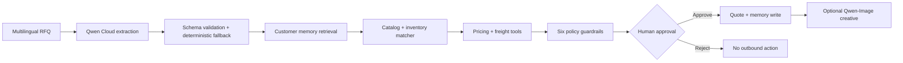

# QuoteX

### The governed RFQ autopilot for cross-border sales teams

QuoteX turns an ambiguous, multilingual buyer message into a ready-to-review commercial quote. Qwen Cloud extracts intent from unstructured text; deterministic tools validate catalog, inventory, pricing, margin, shipping, and account policy; persistent customer memory improves the next decision; and a mandatory human checkpoint prevents an offer from being sent autonomously.

Built for **Track 4: Autopilot Agent** in the Global AI Hackathon Series with Qwen Cloud.

## Why this matters

Export sales teams do not receive clean forms. They receive Japanese email fragments, forwarded messages, vague references such as “the same board,” contradictory product requests, deadlines, freight ceilings, and payment expectations. A wrong answer can lose margin, promise unavailable stock, or damage a customer relationship.

QuoteX automates the repetitive work while keeping the commercial decision accountable.

## Winner-level proof

- **Real Qwen boundary:** multilingual RFQ extraction uses Qwen Cloud through a server-side proxy. The UI exposes model, endpoint host, latency, token usage, sanitized prompt, and structured response.
- **Non-trivial tool workflow:** catalog matching, memory retrieval, freight scoring, margin-safe pricing, risk assessment, and approval policy are separate deterministic stages.
- **Production-safe degradation:** when Qwen is unavailable, the workflow uses a labeled deterministic parser instead of pretending that a model call succeeded.
- **Persistent learning:** approved outcomes are written to a versioned browser store, recalled on future RFQs, capped per customer, and expired after 365 days.
- **Human control:** every commercial offer stops at a human approval gate. Model text never directly triggers an outbound send.
- **Multimodal output:** Qwen creates the campaign brief and Qwen-Image Edit transforms an uploaded product image; an explicitly labeled fallback keeps the demo usable.
- **Cloud-ready:** the server listens on `0.0.0.0`, includes a health endpoint and security headers, and ships with an AMD64-compatible container path for Alibaba Cloud Function Compute.

## Three-minute demo

1. Choose **Mori Lighting — 500 boards** and keep **Live Qwen** selected.
2. Run the autopilot. Watch Qwen parse Japanese, then inspect the verified tool stages and execution-proof cards.
3. Open **Quote** to see the commercial calculation and **Qwen Trace** to verify the real model boundary.
4. Approve the quote. QuoteX stores the approved price and carrier as a customer outcome.
5. Click **Test the next RFQ with this memory**. Run the 800-unit follow-up and show the recalled outcome changing pricing or routing confidence.
6. Open **Creative**, upload a product image, and generate a Qwen-edited campaign asset.

The full narration is in [docs/DEMO_SCRIPT.md](docs/DEMO_SCRIPT.md).

## Architecture



The browser owns the interactive workbench and deterministic business tools. The Node server owns secrets, Qwen requests, health checks, and image generation. See [docs/ARCHITECTURE.md](docs/ARCHITECTURE.md) for boundaries, failure modes, memory lifecycle, and the threat model.

## Run locally

Requirements: Node.js 20 or newer. There are no runtime package dependencies.

```bash
npm install
cp .env.example .env
npm start
```

Open `http://127.0.0.1:4173`.

The deterministic demo works without credentials. To prove live Qwen usage, set at least:

```env
QWEN_API_KEY=your_key
QWEN_MODEL=qwen3.6-flash
```

Use a separate regional image key when required:

```env
QWEN_IMAGE_API_KEY=your_image_workspace_key
QWEN_IMAGE_MODEL=qwen-image-2.0-pro
QWEN_IMAGE_BASE_URL=https://your_image_workspace.ap-southeast-1.maas.aliyuncs.com/api/v1
```

Secrets are read only on the server and are never returned to the browser.

## Verify

```bash
npm test
npm run typecheck
npm run build
npm run probe:qwen
npm run probe:qwen-image
curl http://127.0.0.1:4173/api/health
```

The test suite covers RFQ parsing, product matching, pricing, risk escalation, memory impact, memory retention, human approval, creative fallback, and live image-edit request construction.

## Inference modes

| Mode | What happens | Judge-visible proof |
| --- | --- | --- |
| Live Qwen | Calls the configured Qwen Cloud text model | Trace shows live status, model, host, latency, tokens, prompt, response |
| Resilient demo | Uses the deterministic parser | Every fallback is labeled; downstream tools and human gate still work |

The fallback is a reliability feature, not a simulated Qwen success. QuoteX never labels a deterministic result as a live model call.

## Alibaba Cloud deployment

QuoteX includes a production container that listens on Function Compute's expected `0.0.0.0:9000` default. Build it for the AMD64 architecture used by Function Compute:

```bash
docker build --platform linux/amd64 -t quotex:latest .
docker run --rm -p 9000:9000 --env-file .env quotex:latest
```

Push the image to Alibaba Cloud Container Registry in the same region and account as the Function Compute function, then configure a Custom Container/Web Function with listening port `9000`. Follow [docs/DEPLOYMENT.md](docs/DEPLOYMENT.md) and record the required deployment proof from the real cloud environment.

## Repository map

```text
src/
  main.ts             Typed workbench and human checkpoint
  rfq-engine.ts       Catalog, memory, pricing, freight, risk, and audit logic
  memory-store.ts     Versioned cross-session memory with expiry and bounds
  qwen-client.ts      Live/fallback mode and browser-to-server boundary
  types.ts            Shared domain and API contracts
server/
  qwen-parser.ts      Hardened Qwen extraction and trace capture
  marketing-asset.ts Qwen creative brief + Qwen-Image Edit
  config.ts           Environment and endpoint configuration
tools/
  serve.ts            Typed secure HTTP server
tests/                TypeScript engine and multimodal integration tests
dist/                 Generated JavaScript; ignored by Git
docs/                 Architecture, deployment, demo, and rubric evidence
```

## Documentation

- [Architecture and safety](docs/ARCHITECTURE.md)
- [Alibaba Cloud deployment proof](docs/DEPLOYMENT.md)
- [Judge demo script](docs/DEMO_SCRIPT.md)
- [Ready-to-paste Devpost draft](docs/DEVPOST_SUBMISSION.md)
- [Judging scorecard](docs/JUDGING_SCORECARD.md)

## License

[MIT](LICENSE)
