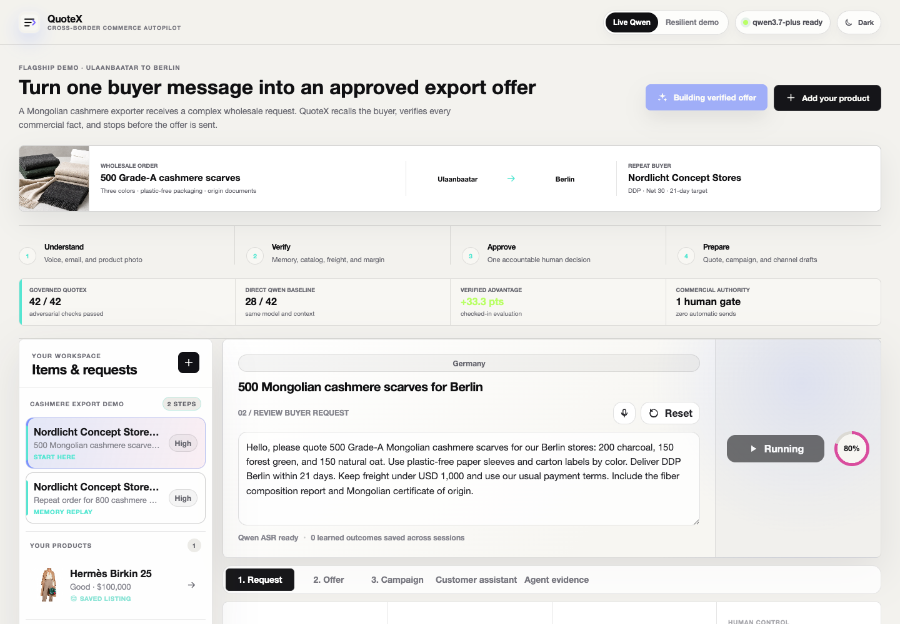
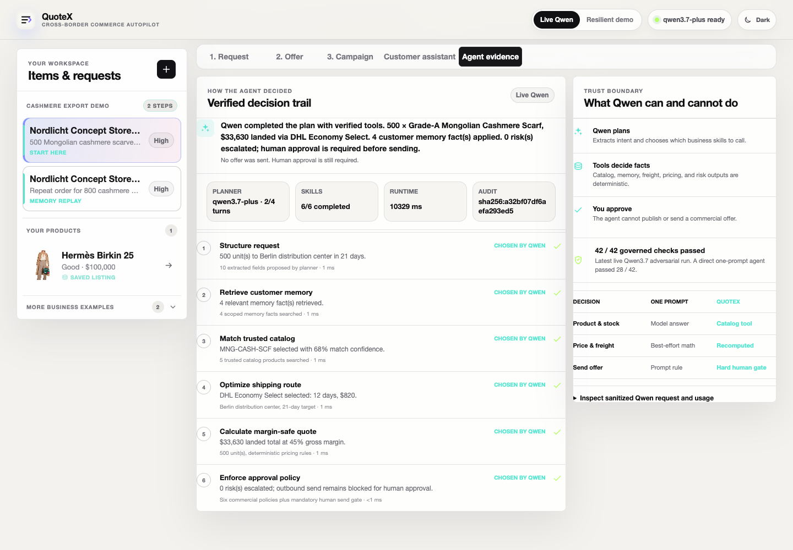
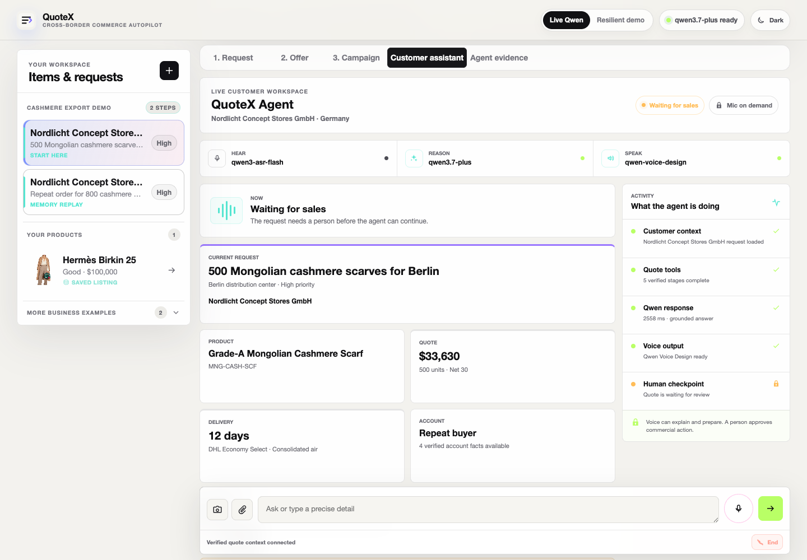
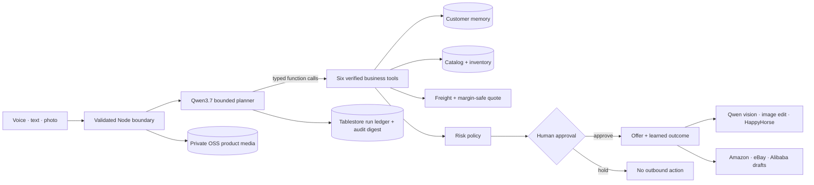

# QuoteX

### The governed RFQ autopilot for cross-border sales teams

QuoteX turns any seller product or ambiguous multilingual buyer request into a ready-to-review cross-border offer. Qwen Cloud plans with typed function tools; deterministic code owns catalog facts, pricing, routing, and policy; persistent memory improves later decisions; and a mandatory human checkpoint prevents publication or sending without approval.

Built for **Track 4: Autopilot Agent** in the Global AI Hackathon Series with Qwen Cloud.



## Why this matters

Export sales teams do not receive clean forms. They receive short emails, forwarded messages, vague references such as “the same board,” contradictory product requests, deadlines, freight ceilings, and payment expectations. A wrong answer can lose margin, promise unavailable stock, or damage a customer relationship.

QuoteX automates the repetitive work while keeping the commercial decision accountable.

## Judge-ready proof

- **Real Qwen tool agent:** Qwen3.7 chooses six strict function tools in a bounded loop: structure request, retrieve memory, match catalog, select shipping, calculate quote, and enforce policy. Every tool call, deterministic result, planner turn, latency, and audit digest is visible in **Agent evidence**.
- **Conversational product intake:** **Add a product** turns voice or text into editable listing facts across electronics, fashion, home, beauty, collectibles, sports, industrial goods, and resale categories. Qwen asks only for missing required details; Tablestore persists validated records and private OSS keeps product photos in cloud mode.
- **Real voice intake:** browser audio is sent to Qwen ASR, with quantities, dates, prices, and product codes preserved in the transcript. Browser speech recognition is a labeled compatibility fallback.
- **Customer Voice Workspace:** voice, text, camera, and image context share one live Qwen3.7 session. The workspace surfaces quote facts, delivery, approval state, model activity, recovery, and optional transcript instead of hiding work behind a microphone animation. Qwen Voice Design creates the QuoteX brand voice, and the matching Qwen3-TTS-VD model synthesizes it. Streaming WAV headers are normalized for browser playback, and transient signed-asset downloads use bounded retry.
- **Non-trivial tool workflow:** Qwen plans, but trusted code executes memory relevance, phrase-polarity catalog matching, freight optimization, margin-safe pricing, risk assessment, and the approval policy. The model cannot set a price or bypass a gate.
- **Production-safe degradation:** missing, timed-out, malformed, or quota-limited Qwen calls trigger bounded guardrail completion. Recovery is labeled and persisted; it is never presented as live model success.
- **Durable run ledger:** the last 200 agent runs are stored in Tablestore in cloud mode, with model, planner turns, skill coverage, latency, human gate, and a SHA-256 evidence digest. SQLite remains the zero-setup local adapter.
- **Persistent learning:** approved outcomes are written to a versioned browser store, recalled on future RFQs, capped per customer, and expired after 365 days.
- **Human control:** every commercial offer stops at a human approval gate. Model text never directly triggers an outbound send.
- **Multimodal output:** Qwen3.7 grounds a campaign brief in the uploaded photo, a Wan/Qwen image router creates the commercial edit, and HappyHorse turns the resulting frame into a five-second product video. Image URLs are downloaded immediately; video task state and provider provenance remain visible.
- **Marketplace adapters:** one verified seller record produces validation-first Amazon, eBay, and Alibaba.com draft payloads with platform-specific condition mappings, title limits, marketplace IDs, missing fields, warnings, and JSON export. Publishing remains disabled until OAuth and human approval exist.
- **Measured baseline:** `npm run benchmark` executes 100 checked-in workflows and currently reports 100% product selection, quote arithmetic, approval-gate enforcement, and no-model fallback completion. It deliberately makes no unmeasured human-time claim.
- **Measured architecture advantage:** a live six-case adversarial evaluation gave the governed Qwen tool agent **42/42 checks** versus **28/42** for the same Qwen3.7 model producing the decision in one prompt, a **33.3-point lift**. The fixtures, scorer, result, and limitations are checked in.
- **Executable Alibaba Cloud stack:** official SDKs provision Tablestore, private OSS, SLS, and a least-privilege RAM role; an AMD64 publisher captures the immutable ACR digest; the FC3 SDK creates or updates the Custom Container and protected HTTP entry point.
- **Live Alibaba runtime:** the ACR-free build is deployed on Function Compute in Japan (Tokyo). Its public health check reports the real FC runtime and configured Qwen services; paid AI routes remain protected by a private access token.



## 102-second judge demo

The primary submission film is the 1080p frame-accurate [Remotion judge cut](docs/CINEMATIC_DEMO.md). It uses real application clips, continuous camera choreography, kinetic type, and synchronized typewriter, interface, shutter, impact, and whoosh sound design. The original evidence-led recording remains available as a slower technical backup.

1. Start with the 500-scarf Ulaanbaatar-to-Berlin buyer request, its product photo, and four recalled buyer requirements.
2. Open **Agent evidence** to show all six Qwen-selected skills, trusted results, audit digest, and the 42/42 versus 28/42 adversarial comparison.
3. Open **Offer** to show recomputed pricing and the locked human checkpoint.
4. Open **Campaign** to compare the source photo with the generated image, then show validation-first Amazon, eBay, and Alibaba.com drafts.
5. Show the prepared customer answer with Qwen3.7 and Qwen Voice Design both complete.
6. Switch to **Resilient demo** to prove the same six tools run with zero model turns and the send gate still closed.
7. End on the architecture diagram.



The upload-ready local artifacts, exact timecodes, narration, and QA evidence are in [docs/CINEMATIC_DEMO.md](docs/CINEMATIC_DEMO.md) and [docs/DEMO_SCRIPT.md](docs/DEMO_SCRIPT.md).

## Architecture



The Node service owns secrets, live Qwen planning, verified tool execution, and the durable audit ledger. The browser owns the editable workbench and can run the same deterministic safety path when live inference is disabled. See [docs/ARCHITECTURE.md](docs/ARCHITECTURE.md) for data flow, failure modes, memory lifecycle, and threat model.

The architecture diagram also ships as a judge-ready [SVG](diagrams/quotex-agent-architecture.svg), [PNG](diagrams/quotex-agent-architecture.png), and editable [Excalidraw file](diagrams/quotex-agent-architecture.excalidraw).

## Model strategy

| Role | Default | Reason |
| --- | --- | --- |
| Tool planning + RFQ extraction | `qwen3.7-plus` | Strong multilingual function calling; strict schemas, missing-tool repair, and a four-turn ceiling keep agency bounded |
| Customer answers | `qwen3.7-plus` | Grounded, policy-bounded customer support |
| Product-photo understanding | `qwen3.7-plus` | Flagship multimodal grounding and structured output |
| Voice transcription | `qwen3-asr-flash` | Full-recording multilingual transcription through the compatible API |
| Voice identity | `qwen-voice-design` | Creates a warm, conversational QuoteX brand voice from a natural-language description |
| Spoken response | `qwen3-tts-vd-2026-01-26` | Synthesizes the designed voice; target model is required to match the design request |
| Primary image edit | `wan2.7-image-pro` | Recommended starting point for brand control and image editing |
| Image fallback | `qwen-image-2.0-pro` | Strong semantic adherence and negative-prompt control |
| Product video | `happyhorse-1.0-i2v` | Animates the uploaded or AI-edited first frame through a traceable async task |

This routing follows the official [model selection](https://docs.qwencloud.com/developer-guides/getting-started/model-selection), [structured output](https://docs.qwencloud.com/developer-guides/text-generation/structured-output), [speech recognition](https://docs.qwencloud.com/api-reference/speech-recognition/qwen-asr/openai), [voice design](https://docs.qwencloud.com/developer-guides/speech/voice-design), [speech synthesis](https://docs.qwencloud.com/developer-guides/speech/tts), [vision](https://docs.qwencloud.com/developer-guides/multimodal/vision), and [image editing](https://docs.qwencloud.com/developer-guides/image-generation/image-editing) guides. Environment variables can override each role when a workspace exposes a different model set.

## Run locally

Requirements: Node.js 22.15 or newer. `npm install` provides the Alibaba Tablestore and OSS runtime adapters; local mode uses Node's built-in SQLite module.

```bash
npm install
cp .env.example .env
npm start
```

Open `http://127.0.0.1:4173`.

The deterministic demo works without credentials. To prove live Qwen usage, set at least:

```env
QWEN_API_KEY=
QWEN_BASE_URL=https://dashscope-intl.aliyuncs.com/compatible-mode/v1
QWEN_MODEL=qwen3.7-plus
QWEN_AGENT_MODEL=qwen3.7-plus
QWEN_VISION_MODEL=qwen3.7-plus
QWEN_ASR_MODEL=qwen3-asr-flash
QWEN_VOICE_DESIGN_MODEL=qwen-voice-design
QWEN_VOICE_DESIGN_TARGET_MODEL=qwen3-tts-vd-2026-01-26
QWEN_TTS_MODEL=qwen3-tts-vd-2026-01-26
QWEN_TTS_VOICE=
QWEN_VIDEO_MODEL=happyhorse-1.0-i2v
```

Use a separate regional image key when required:

```env
QWEN_IMAGE_API_KEY=
QWEN_IMAGE_MODEL=wan2.7-image-pro
QWEN_IMAGE_FALLBACK_MODEL=qwen-image-2.0-pro
QWEN_IMAGE_BASE_URL=https://your_image_workspace.ap-southeast-1.maas.aliyuncs.com/api/v1
```

The key and every endpoint must belong to the same region. An international key works with `dashscope-intl.aliyuncs.com`; a workspace key works with that workspace's dedicated compatible and DashScope endpoints. They are not interchangeable. Enable both `qwen-voice-design` and `qwen3-tts-vd-2026-01-26`: the first creates a custom voice, while the second synthesizes speech with it. The first successful design is cached in `.runtime/`; leave `QWEN_TTS_VOICE` empty to create it automatically. Qwen may apply its documented voice-design quota or charge. Secrets are read only on the server and never returned to the browser.

Seller listings default to `.runtime/quotex.sqlite` for local development. Cloud mode uses Alibaba Tablestore for listing metadata and agent-run evidence plus private OSS for original product photos. Function Compute accesses both through short-lived credentials from a least-privilege RAM execution role.

## Verify

```bash
npm test
npm run typecheck
npm run build
npm run benchmark
npm run evaluate
npm run verify:submission
npm run deploy:plan
npm run probe:qwen
npm run probe:qwen-image
npm run probe:happyhorse
curl http://127.0.0.1:4173/api/health
```

`probe:qwen-image` creates one small image-edit request. `probe:happyhorse` creates the minimum three-second 720P video and is billed by Qwen per generated second.

Use `npm run evaluate -- --live` to compare the live governed Qwen tool agent with the live one-prompt Qwen baseline. The test suite covers Qwen tool-call contracts, model-proposed quantity conflicts, bounded recovery, prompt-injection resistance, memory-query isolation, agent-run persistence, product intake and SQLite CRUD, phrase-polarity catalog matching, marketplace adapters, RFQ parsing, Qwen ASR, customer-safe grounding, Qwen Voice Design/TTS reuse, HappyHorse tasks, pricing, risk escalation, memory, approval, image grounding, model failover, and generated-asset persistence.

## Inference modes

| Mode | What happens | Judge-visible proof |
| --- | --- | --- |
| Live Qwen | Qwen chooses typed business tools in a bounded server loop | Evidence shows model, turns, each tool call/result, host, latency, tokens, and digest |
| Resilient demo | Runs the same trusted business core without the planner | Every guarded completion is labeled; quote logic and human gate still work |

The fallback is a reliability feature, not a simulated Qwen success. QuoteX never labels a deterministic result as a live model call.

## Alibaba Cloud deployment

QuoteX has two executable Function Compute deployment paths:

- `code-package`: an ACR-free 2.85 MB ZIP that runs on Function Compute's built-in Node.js 20 executable. It is the fastest judge-demo route and uses explicitly non-durable memory storage unless Alibaba Tablestore and OSS are configured.
- `custom-container`: an immutable AMD64 ACR image with Tablestore, private OSS, SLS, and a least-privilege RAM role for the durable production architecture.

### Verified live deployment

- Application: [QuoteX on Alibaba Function Compute](https://quotex-utopilot-vybltedhtp.ap-northeast-1.fcapp.run)
- Public health: [`GET /api/health`](https://quotex-utopilot-vybltedhtp.ap-northeast-1.fcapp.run/api/health)
- Region and runtime: `ap-northeast-1`, `custom.debian10`, built-in Node.js 20
- Deployed source: commit [`74b0470`](https://github.com/mongonsh/QuoteX/commit/74b04703946fd8dd317f5ead5388ac76f9127eea)
- Machine-readable proof: [docs/alibaba-deployment-evidence.json](docs/alibaba-deployment-evidence.json)

The public URL loads the interface and exposes health metadata. Live paid AI endpoints require the private judge link and return `401` without it. This judge deployment honestly reports `storage.provider: "memory"` and `durable: false`; the checked-in Tablestore, OSS, SLS, and RAM path is the durable production deployment.

Build and inspect the ACR-free request:

```bash
npm run deploy:prepare
npm run deploy:package
npm run deploy:plan
npm run deploy:fc
```

Set `ALIBABA_FC_DEPLOYMENT_MODE=code` and `QUOTEX_STORAGE_PROVIDER=memory` for that demo route. The full apply sequence remains `npm run provision:alibaba`, `npm run image:publish`, and `npm run deploy:fc`; it provisions managed storage and logging, captures an immutable ACR digest, then creates or updates Function Compute and its HTTP trigger. Both dry runs redact every Qwen key and the private demo token.

Devpost specifies a repository code-file link as the required Alibaba Cloud deployment proof. Use [server/alibaba-fc-deployment.ts](server/alibaba-fc-deployment.ts): it constructs and executes the official FC3 `CreateFunction`/`UpdateFunction` and HTTP-trigger requests. [server/alibaba-cloud-infrastructure.ts](server/alibaba-cloud-infrastructure.ts) provisions Tablestore, OSS, SLS, and RAM, while [server/qwen-tool-orchestrator.ts](server/qwen-tool-orchestrator.ts) shows the live Qwen Cloud runtime boundary. The separate [deployment evidence](docs/alibaba-deployment-evidence.json) binds the running endpoint and ZIP digest to the exact deployed commit.

The code-proof requirement is distinct from additional runtime evidence. The Function Compute URL, artifact digest, health response, and authenticated Qwen smoke test were recorded only after the apply command succeeded. Follow [docs/DEPLOYMENT.md](docs/DEPLOYMENT.md) for the evidence contract and both reproducible deployment paths.

## Repository map

```text
src/
  main.ts             Typed workbench and human checkpoint
  rfq-engine.ts       Catalog, memory, pricing, freight, risk, and audit logic
  marketplace-adapters.ts Amazon, eBay, and Alibaba validation drafts
  memory-store.ts     Versioned cross-session memory with expiry and bounds
  qwen-client.ts      Live/fallback mode and browser-to-server boundary
  types.ts            Shared domain and API contracts
server/
  qwen-tool-orchestrator.ts Bounded Qwen function-calling planner
  agent-evaluation.ts Fair governed-versus-single-prompt evaluator
  alibaba-cloud-infrastructure.ts Tablestore, OSS, SLS, and RAM provisioning
  alibaba-storage.ts Durable Tablestore and OSS repositories
  alibaba-fc-deployment.ts Idempotent FC3 function and trigger deployment
  agent-run-store.ts  SQLite agent evidence ledger
  listing-store.ts    Validated SQLite seller listing and photo repository
  qwen-parser.ts      Hardened Qwen extraction and trace capture
  qwen-asr.ts         Validated Qwen speech-to-text boundary
  customer-agent.ts   Customer-safe quote support and escalation
  qwen-tts.ts         Qwen Voice Design, cached voice reuse, and audio persistence
  happyhorse-video.ts Async product-video submission and task polling
  marketing-asset.ts Qwen vision brief + Wan/Qwen image router
  config.ts           Environment and endpoint configuration
tools/
  serve.ts            Typed secure HTTP server
  benchmark-agent.ts  Repeatable deterministic quality baseline
  evaluate-agent.ts   Six-case live/offline adversarial evaluation
  provision-alibaba-cloud.ts Idempotent managed-resource provisioning
  publish-alibaba-image.ts Secret-safe AMD64 ACR publish and digest capture
  deploy-alibaba-fc.ts Secret-safe FC3 create/update command
tests/                TypeScript engine and multimodal integration tests
dist/                 Generated JavaScript; ignored by Git
docs/                 Architecture, deployment, demo, and rubric evidence
```

## Documentation

- [Architecture and safety](docs/ARCHITECTURE.md)
- [Benchmark methodology](docs/BENCHMARKS.md)
- [Governed agent evaluation](docs/EVALUATION.md)
- [Alibaba Cloud deployment proof](docs/DEPLOYMENT.md)
- [Judge demo script](docs/DEMO_SCRIPT.md)
- [Cinematic judge film](docs/CINEMATIC_DEMO.md)
- [Ready-to-paste Devpost draft](docs/DEVPOST_SUBMISSION.md)
- [Publish-ready technical blog](docs/BLOG_POST.md)
- [Judging scorecard](docs/JUDGING_SCORECARD.md)

## License

[MIT](LICENSE)
