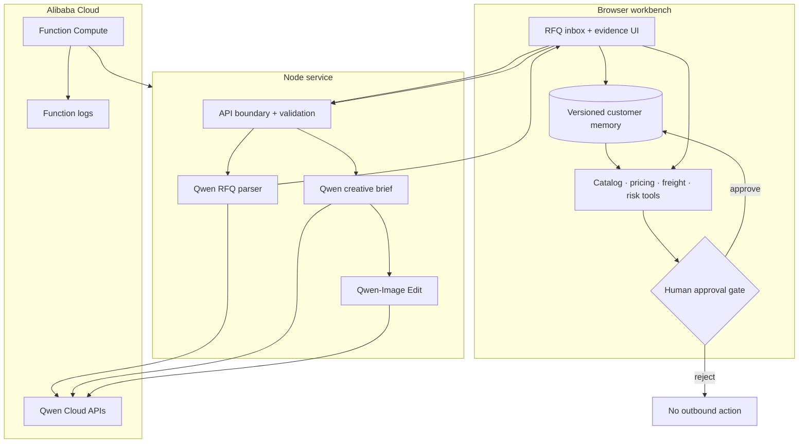

# QuoteX architecture and safety

## Design principle

Qwen handles the ambiguity that benefits from language reasoning. Deterministic tools handle money, inventory, policy, and control flow. A human owns the irreversible commercial decision.

## Execution boundaries

| Stage | Implementation | Why |
| --- | --- | --- |
| RFQ extraction | Live Qwen or labeled deterministic fallback | Multilingual ambiguity benefits from model reasoning; fallback protects the demo |
| Customer recall | Deterministic relevance scoring over persisted facts | Repeatable, inspectable, and bounded |
| Product selection | Alias/term ranking against the catalog | Prevents hallucinated SKUs from becoming quotes |
| Pricing | Deterministic rules | Money and margin floors must be reproducible |
| Freight | Deterministic scoring | Deadline, reliability, cost ceiling, and memory effects remain explainable |
| Risk policy | Six explicit checks | Ambiguity, margin, stock, new buyer, timing, and manual-review conditions are auditable |
| Approval | Human-only | No commercial offer is sent autonomously |
| Creative | Qwen brief + Qwen-Image Edit | Multimodal generation is optional and does not affect quote policy |

## Memory lifecycle

1. QuoteX retrieves static CRM-style facts plus approved outcomes saved in the browser.
2. Relevance scoring selects only memories connected to the current RFQ.
3. The engine records the count and measurable pricing/routing influence.
4. Only human-approved outcomes are written.
5. Each customer's learned store is capped at 12 facts.
6. Learned facts expire after 365 days and can be cleared from the UI.

The local store is a demo implementation of the persistence contract. A production system would replace it with an authenticated database while preserving the same read/write boundary.

## Failure modes

| Failure | Behavior |
| --- | --- |
| Qwen key missing | Parser returns `missing-key`; browser uses the labeled fallback |
| Qwen timeout or non-JSON response | Error is captured in the trace; fallback continues |
| Image model unavailable | A deterministic edited preview is generated and labeled |
| Storage blocked or full | Workflow remains usable without writing learned memory |
| Unknown product | A `CUSTOM-REVIEW` item is created and high-risk manual sourcing is required |
| Low product separation | Product ambiguity is escalated to the human gate |
| Inventory shortfall | High-risk issue blocks blind approval |
| Below-floor margin | High-risk issue is shown before approval |

## Threat model

- Buyer RFQ text is treated as untrusted data. The Qwen system prompt explicitly rejects instructions embedded inside an RFQ.
- API keys are loaded from server environment variables and never serialized to the client.
- Every model-derived value is normalized before it reaches deterministic business tools.
- All user/model content rendered as HTML is escaped.
- Requests are body-limited; uploaded images are type- and size-checked.
- The server emits CSP, clickjacking, MIME-sniffing, referrer, and permissions headers.
- Trace output exposes endpoint hosts and usage, never credentials.
- There is no autonomous send endpoint. Approval changes local state only.

## API surface

| Method | Path | Purpose |
| --- | --- | --- |
| GET | `/api/health` | Readiness and configured model metadata without secrets |
| POST | `/api/parse-rfq` | Qwen extraction with normalized structured output and trace |
| POST | `/api/generate-marketing-asset` | Qwen brief and optional Qwen-Image Edit |

## Production extensions

- Replace browser memory with Tablestore or another authenticated persistent store.
- Add CRM/catalog connectors as MCP tools behind the same deterministic contracts.
- Sign approval events and outbound quote artifacts.
- Export traces to Simple Log Service and add latency, fallback-rate, and override dashboards.
- Add tenant authentication, rate limits, idempotency keys, and role-based approval thresholds.
