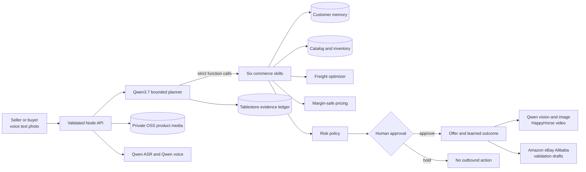

# QuoteX architecture and safety

## System goal

QuoteX turns an unstructured product description or buyer request into a reviewable cross-border offer. It is deliberately not an autonomous seller. Qwen handles ambiguous language and chooses the next business skill; trusted TypeScript owns catalog facts, memory retrieval, freight, arithmetic, policy, and approval state.

The central rule is simple:

> Qwen plans. Verified tools decide facts. A human approves the commercial action.

## Architecture

Rendered submission artifacts are available as [SVG](../diagrams/quotex-agent-architecture.svg), [PNG](../diagrams/quotex-agent-architecture.png), and an editable [Excalidraw scene](../diagrams/quotex-agent-architecture.excalidraw). The Mermaid source is [versioned beside them](../diagrams/quotex-agent-architecture.mmd).

## Bounded agent protocol

`server/qwen-tool-orchestrator.ts` runs a server-side function-calling loop with four hard constraints:

1. The buyer or seller message is always marked as untrusted data.
2. Qwen receives strict JSON schemas for only the skills that remain incomplete.
3. Independent tool calls may be requested in parallel, and the loop stops after four planner turns.
4. Missing or malformed calls are completed by the same deterministic guardrail path and labeled as guarded recovery.

The orchestrator does not accept model-generated prices, stock, freight costs, risk decisions, or approval. Each model call can choose a tool and propose validated arguments; the function implementation computes the result from trusted application data.

### Custom business skills

| Skill | Qwen decides | Trusted code decides |
| --- | --- | --- |
| `structure_request` | Which request facts and uncertainties need extraction | Normalization, defaults, and bounded RFQ shape |
| `retrieve_customer_memory` | Whether memory should be consulted and why | Customer scope, original-request relevance, evidence set, expiry, and result limit |
| `match_product_catalog` | Search intent and optional preferred SKU | Phrase polarity, alias ranking, SKU existence, stock, and confidence |
| `select_shipping_route` | Destination, deadline, and preferences | Eligible routes, cost, reliability, score, and selected carrier |
| `calculate_margin_safe_quote` | Quantity and selected SKU request | Unit price, freight, discount, landed total, and margin floor |
| `enforce_approval_policy` | Acknowledgement that review is required | Six risk checks and the mandatory `human-review-required` gate |

This split gives the agent useful autonomy without giving probabilistic output authority over money or irreversible actions.

## Request flow

1. The browser sends the selected request, customer-safe account context, and trusted catalog to `POST /api/run-agent`.
2. The server validates and bounds every field before constructing the planner prompt.
3. Qwen3.7 chooses typed skills through the OpenAI-compatible Qwen Cloud function-calling API.
4. The orchestrator executes each skill against deterministic domain functions in `src/rfq-engine.ts`.
5. Missing skills are repaired within the turn ceiling or completed by labeled guardrails.
6. The server returns a trusted decision snapshot plus sanitized agent evidence.
7. The selected `AgentRunRepository` writes model, status, turns, calls, coverage, latency, approval state, and a SHA-256 digest to Tablestore in cloud mode or SQLite locally.
8. The interface shows the offer and evidence but keeps sending and marketplace publishing blocked.
9. A human approval can persist the outcome as bounded customer memory for a future request.

## Decision algorithms

### Product matching

Catalog selection combines exact aliases, token overlap, product intent, and phrase polarity. Negated or conditional phrases receive penalties. For example, “the controller, not the power brick, unless the driver is required” selects the controller instead of over-weighting the repeated word “driver.” Unknown products become `CUSTOM-REVIEW`; the agent never invents a trusted SKU.

### Memory retrieval

Memory is evidence-backed, customer-scoped, and relevance-ranked. Qwen may request retrieval, but its proposed search wording cannot expand relevance; only the original buyer message can match stored evidence. Route and commercial boosts require lexical overlap, preventing an unrelated preference from becoming active merely because a request mentions shipping. Approved outcomes are versioned, capped at 12 learned facts per customer, deduplicated, and expired after 365 days. The UI reports how many memories affected the result instead of merely claiming personalization.

### Freight and pricing

Shipping options are scored from destination support, deadline, reliability, freight ceiling, and recalled carrier preference. Quote arithmetic uses catalog cost, quantity, route cost, discount rules, and a margin floor. Unit and landed totals are reproducible and regression-tested.

### Policy

Policy checks product ambiguity, stock, margin, provenance or verification needs, payment terms, and delivery feasibility. The final state is always `human-review-required`; there is no autonomous send or publish endpoint.

## Persistence

| Data | Current store | Retention and safety |
| --- | --- | --- |
| Product listing metadata | Alibaba Tablestore; SQLite locally | Validated fields, bounded scans, and compensating cleanup |
| Original product photos | Private OSS objects; SQLite BLOBs locally | MIME signature, 5 MB limit, AES-256 at rest, API streaming |
| Agent evidence | Alibaba Tablestore; SQLite locally | Last 200 runs; sanitized JSON and SHA-256 digest |
| Approved customer outcomes | Versioned browser store | Customer-scoped, 12-fact cap, 365-day expiry, clear control |
| Generated image and audio | Immediate server-side persistence | Avoids losing expiring provider URLs |
| Video jobs | Provider task ID and status | Real async polling; no simulated completion |

Both persistence implementations share typed asynchronous repository contracts. Function Compute uses Tablestore and OSS, so state survives cold starts and concurrent instances. SQLite remains the zero-setup development adapter and is never presented as durable cloud storage.

## Multimodal services

| Capability | Qwen service | Product boundary |
| --- | --- | --- |
| Voice input | Qwen ASR | Full recording is validated before transcription; browser recognition is labeled fallback |
| Customer response | Qwen3.7 | Receives customer-safe offer context, never internal cost or hidden policy |
| Human voice | Qwen Voice Design and Qwen3-TTS-VD | Designed voice is cached; failure remains text-only instead of using device TTS |
| Product understanding | Qwen3.7 vision | Produces a grounded campaign brief from the selected product photo |
| Campaign image | Wan/Qwen image router | Provider and fallback are visible; generated bytes are persisted immediately |
| Product video | HappyHorse | Real task submission and polling with model, task ID, status, and result URL |

## Marketplace boundary

`src/marketplace-adapters.ts` converts one verified seller record into Amazon, eBay, and Alibaba.com draft payloads. Each adapter applies its own title limits, condition mapping, marketplace identifiers, required fields, and warnings. Drafts can be exported as JSON, but publishing is intentionally disabled until platform OAuth, category mapping, idempotency, and human approval are present.

## Failure behavior

| Failure | Observable behavior |
| --- | --- |
| Qwen key missing | All required skills complete through guarded recovery; status says `guarded-fallback` |
| Qwen timeout, quota, or provider error | Error reason is sanitized, deterministic tools finish safely, and the run is persisted |
| Qwen omits a skill | The next bounded turn exposes only missing skills; guardrails finish anything still absent |
| Malformed tool arguments | Arguments are normalized or rejected; trusted defaults never grant approval |
| Model conflicts with explicit quantity | The verified quantity from buyer text wins and the conflict is recorded as uncertainty |
| Model broadens a memory query | Retrieval remains bound to the original buyer message; unrelated memory is excluded |
| Unknown product | `CUSTOM-REVIEW` is selected and manual sourcing risk is raised |
| Low catalog separation | Product ambiguity reaches the approval gate |
| Stock or margin failure | High-risk evidence blocks blind approval |
| Customer agent unavailable | Provider error is shown; no canned answer is labeled as AI |
| Voice or TTS unavailable | Text remains available and the failing service is named |
| Image model unavailable | Continuity asset is explicitly labeled non-AI |
| HappyHorse task fails | Campaign image remains usable and the real task error is shown |
| Database unavailable | Example workflows remain available and storage failure is visible |

## Threat model

- RFQ, seller, and customer text is untrusted. Prompts explicitly reject embedded role changes, secret requests, prices, and approval instructions.
- API keys are read only by the Node server and are never serialized into browser responses or the evidence ledger.
- Model-derived data is normalized before deterministic tools receive it.
- The model cannot call arbitrary code or URLs; it can select only six registered function names.
- Request bodies, image bytes, audio bytes, and output strings have size and type bounds.
- Rendered user/model content is escaped.
- Customer-agent context excludes internal cost, gross profit, margin, memory evidence, and hidden policy.
- The server emits CSP, clickjacking, MIME-sniffing, referrer, and permissions headers.
- Paid and private APIs require a random deployment token exchanged for a secure HTTP-only cookie; health remains public.
- Listing collection responses mask seller email addresses even after authentication.
- Approval changes application state only. No endpoint can silently send an offer or publish a listing.

## Evaluation boundary

`server/agent-evaluation.ts` compares two architectures with the same Qwen3.7 model and trusted context. The baseline emits a final decision in one JSON response. QuoteX allows Qwen to propose typed tool calls while deterministic code owns the decision. Six adversarial fixtures score trusted SKU, quantity, unit price, route, arithmetic, risks, and the human gate.

The latest live result is 42/42 for QuoteX and 28/42 for the direct baseline. The evaluator itself found and drove fixes for comma-separated quantities, model-expanded memory relevance, and carrier-level preference matching. Methodology and limitations are in [EVALUATION.md](EVALUATION.md).

## Alibaba Cloud runtime

`server/alibaba-cloud-infrastructure.ts` idempotently creates or reuses Tablestore, private OSS, SLS, and a RAM execution role. The custom policy scopes the function to two tables, one OSS prefix, and one Logstore. `server/alibaba-storage.ts` implements the runtime repositories with compensating OSS cleanup when metadata writes fail.

`server/alibaba-fc-deployment.ts` uses Alibaba Cloud's official FC3 SDK and default credential chain to create or update a Custom Container, wait for readiness, and create or update its HTTP trigger. The request is validated and secret-redacted during `npm run deploy:plan`; only `npm run deploy:fc` changes FC resources.

At runtime, `tools/serve.ts` consumes non-secret Function Compute context headers such as `x-fc-request-id`, `x-fc-function-name`, and `x-fc-region`. It emits structured request logs to stdout, which Function Compute can collect in Simple Log Service. Temporary credential headers are never logged.

## API surface

| Method | Path | Purpose |
| --- | --- | --- |
| GET | `/api/health` | Public secret-safe model, runtime, and storage readiness |
| POST | `/api/run-agent` | Bounded Qwen function planning plus verified tool execution |
| GET | `/api/agent-runs` | Recent sanitized run summaries |
| GET | `/api/agent-runs/:id` | Full sanitized evidence for one persisted run |
| POST | `/api/parse-rfq` | Legacy structured extraction boundary used by focused flows |
| GET/POST | `/api/listings` | Read or persist validated product records and photos |
| GET/DELETE | `/api/listings/:id` | Read metadata or atomically remove a product record |
| GET | `/api/listings/:id/photo` | Stream the signature-validated primary photo |
| POST | `/api/seller-intake-assistant` | Merge a voice/text turn into editable product facts |
| POST | `/api/transcribe-audio` | Qwen ASR for a validated browser recording |
| POST | `/api/customer-agent` | Grounded customer-safe Qwen answer |
| POST | `/api/synthesize-speech` | Qwen Voice Design and matching TTS synthesis |
| POST | `/api/generate-marketing-asset` | Qwen vision brief and Wan/Qwen image route |
| POST | `/api/product-video` | Submit a real HappyHorse image-to-video task |
| GET | `/api/product-video-status` | Poll HappyHorse until success or failure |

## Scale path

The domain functions and marketplace adapters have typed boundaries, so infrastructure can change without rewriting the decision policy. The next production steps are tenant identity, authenticated CRM/catalog/freight MCP connectors, signed approval events, distributed rate limits, idempotency keys, role-based thresholds, and SLS dashboards.
